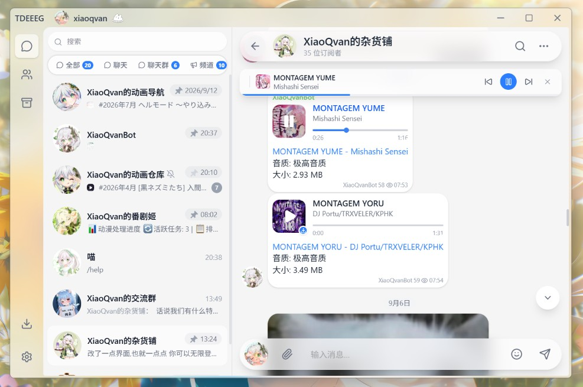

# tdeeeg

English | [简体中文](README.zh-CN.md)

> ⚠️ **This project is still under active development.** Most core features are implemented, but some parts may be unstable or not behave as expected. Feel free to try it out and open an issue.

A Telegram desktop client built with [Tauri 2](https://v2.tauri.app/) + [Vue 3](https://vuejs.org/) + [TDLib](https://core.telegram.org/tdlib), developed entirely by AI agents. Expect occasional instability and inconsistent UI styling.



## Platform notes

### macOS

The current maintainer does not have a macOS device, so the macOS build is neither tested nor packaged. Tauri should theoretically support macOS, but this has not been verified in practice. Developers with a macOS environment are welcome to try building it and help improve macOS support.

### Linux

The Linux build has not been adapted or verified yet, mainly due to limited maintainer bandwidth. Contributors interested in Linux support are welcome to help and submit a PR.

## Contributing

This project is developed entirely with AI tools, so contributions made with the help of AI tools are equally welcome. PRs that improve the app are appreciated. Please include the test environment, build steps, and verification results in your PR description to ease review and merging.

## Tech stack

| Layer | Technology |
|------|------------|
| Desktop framework | Tauri 2 (Rust) |
| Frontend framework | Vue 3 + TypeScript + Vite |
| Telegram protocol | TDLib (via Rust FFI) |

## Recommended IDE

- [VS Code](https://code.visualstudio.com/) + [Vue - Official](https://marketplace.visualstudio.com/items?itemName=Vue.volar) + [Tauri](https://marketplace.visualstudio.com/items?itemName=tauri-apps.tauri-vscode) + [rust-analyzer](https://marketplace.visualstudio.com/items?itemName=rust-lang.rust-analyzer)

## Feature status

### Core chat
- [x] Login flow (phone number + code + 2FA password)
- [x] Chat list (folders, sorting, search, archive)
- [x] Sending and receiving messages (text, image, video, file, audio, sticker)
- [x] Message context menu (reply, forward, copy, delete, pin)
- [x] Message entity rendering (bold, italic, links, code blocks, quotes, custom emoji)
- [x] Sticker manager (stickers, emoji, GIF)
- [x] Album messages
- [x] Rich text messages (`messageRichMessage`)
- [x] Forward picker
- [x] Multi-select message actions
- [x] Message translation
- [x] Sender identity picker
- [x] Message reactions
- [x] Message search
- [x] Message editing
- [x] Draft sync
- [ ] Translate-all button
- [ ] Voice / video calls
- [ ] More message types (polls, location sharing, etc.)

### Media & files
- [x] Global media viewer (image / video / album browsing)
- [x] Streaming video playback (play while downloading)
- [x] Auto-download settings (per chat type and file size)
- [x] Download manager (Rust persistence, live progress)
- [x] GIF / sticker animation (TGS Lottie + WebP/WebM)
- [x] Stories
- [x] Story player

### Social & interaction
- [x] Profile page (work in progress)
- [x] Contacts list
- [x] Channel / group / topic mode (list)
- [x] Gift showcase
- [x] Premium status modification
- [ ] Topic mode (tabs)
- [ ] Group / channel management (create, edit, member management)
- [ ] Gift purchase and sending
- [ ] Telegram Premium feature showcase
- [ ] Global search box

### Settings
- [x] Profile editing
- [x] Privacy settings
- [x] Auto-download settings
- [x] Storage location
- [x] Proxy settings
- [x] Active sessions
- [x] Custom API ID / API HASH
- [x] Multi-account support
- [x] Notification settings
- [ ] Chat folder management
- [ ] Theme customization
- [x] Multi-language support

## Development setup

### 1. TDLib

Place the compiled TDLib dynamic library into the `src-tauri/bin` directory:

| Platform | File |
|------|------|
| Windows | `tdjson.dll` |
| macOS | `libtdjson.dylib` |
| Linux | `libtdjson.so` |

Recommended TDLib version: 1.8.66

### 2. Environment variables

Create a `.env` file in the `src-tauri` directory with your Telegram API credentials:

```env
TG_API_ID=123456
TG_API_HASH=xxxxxxxxxxxxxxxxxxxxxxxxxxxxxx
```

Get them at [my.telegram.org](https://my.telegram.org/).

### 3. Install dependencies

npm, pnpm, or bun (recommended) all work:

```bash
bun install
```

## Build & debug

### Development mode

```bash
bun run tauri dev
```

### Production build

```bash
bun run tauri build
```

### Frontend-only build check (no Rust)

```bash
# TypeScript type check
bunx vue-tsc --noEmit

# Vite build
bunx vite build
```

### Rust compile check

```bash
cd src-tauri && cargo check
```

---

## Project structure

```
src/
├── assets/              # Static assets (CSS, sticker animations)
├── components/          # UI components
│   ├── audio/           # Music player
│   ├── chat/            # Chat-related (ChatDetail, message content, avatars)
│   ├── common/          # Shared components
│   ├── contextMenu/     # Context menu system
│   ├── downloads/       # Download manager
│   ├── layout/          # Layout components
│   └── settings/        # Settings widgets
├── composables/         # Vue composables
├── directives/          # Custom directives (smooth scroll, context menu)
├── locales/             # i18n translation files
├── router/              # Router configuration
├── store/               # Pinia state management
├── types/               # TypeScript type definitions
├── utils/               # Utility functions
└── views/               # Route pages (auth/home/settings/user)
src-tauri/
├── src/
│   ├── lib.rs           # Tauri plugin initialization
│   ├── main.rs          # App entry point
│   ├── tdlib.rs         # TDLib FFI wrapper
│   ├── chat_store.rs    # Chat data cache (Rust side)
│   ├── download_store.rs# Download persistence
│   └── media_stream.rs  # Video streaming
└── bin/                 # TDLib dynamic libraries
```

---

## Development notes

This project is developed end-to-end with AI agent tooling, mainly:

- **GitHub Copilot**
- **Codex**
- **Claude CLI**

Workflow:

1. Clarify feature requirements and technical approach
2. Generate code with AI assistance
3. Type check with `vue-tsc --noEmit`
4. Compile check with `cargo check`
5. Verify with `bun run tauri dev`

---

## License

This project is released under the [GNU General Public License v3.0](LICENSE). See the [LICENSE](LICENSE) file for the full text.
