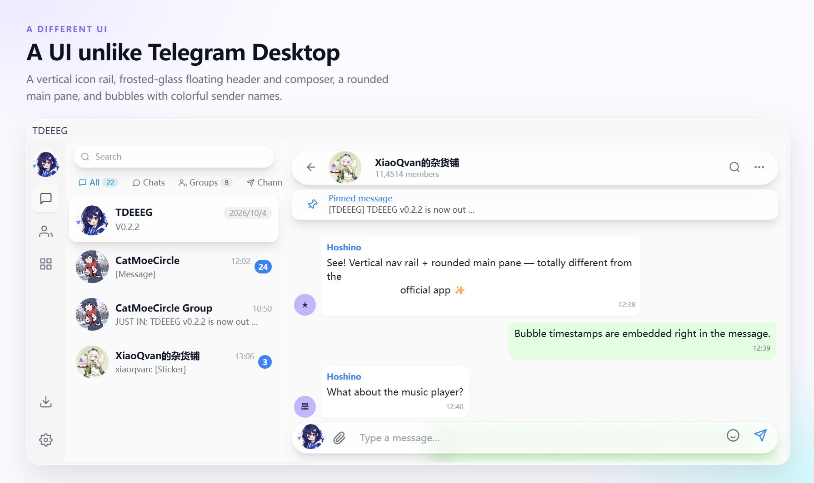

# tdeeeg

[English](README.md) | [简体中文](README.zh-CN.md) | Русский

> ⚠️ **Проект находится в активной разработке.** Большинство ключевых функций уже реализовано, но некоторые части могут работать нестабильно или вести себя не так, как ожидается. Пробуйте и открывайте issue.

Клиент Telegram для десктопа на базе [Tauri 2](https://v2.tauri.app/) + [Vue 3](https://vuejs.org/) + [TDLib](https://core.telegram.org/tdlib), полностью разработанный AI-агентами. Возможны периодические сбои и несогласованность стилей интерфейса.




## Замечания по платформам

### macOS

У текущего мейнтейнера нет устройства на macOS, поэтому сборка для macOS не тестируется и не упаковывается. Теоретически Tauri поддерживает macOS, но на практике это не проверялось. Разработчики с окружением macOS могут попробовать собрать проект и помочь улучшить поддержку macOS.

### Linux

Сборка для Linux пока не адаптирована и не проверена — в основном из-за ограниченных ресурсов мейнтейнера. Желающие помочь с поддержкой Linux могут прислать PR.

## Участие в проекте

Проект разрабатывается полностью с помощью AI-инструментов, поэтому вклад, сделанный с их использованием, так же приветствуется. Мы рады PR, улучшающим приложение. Пожалуйста, указывайте в описании PR тестовое окружение, шаги сборки и результаты проверки — так проще провести ревью и влить изменения.

## Технологический стек

| Слой | Технология |
|------|------------|
| Фреймворк для десктопа | Tauri 2 (Rust) |
| Фронтенд | Vue 3 + TypeScript + Vite |
| Протокол Telegram | TDLib (через Rust FFI) |

## Рекомендуемая IDE

- [VS Code](https://code.visualstudio.com/) + [Vue - Official](https://marketplace.visualstudio.com/items?itemName=Vue.volar) + [Tauri](https://marketplace.visualstudio.com/items?itemName=tauri-apps.tauri-vscode) + [rust-analyzer](https://marketplace.visualstudio.com/items?itemName=rust-lang.rust-analyzer)

## Состояние функций

### Основной чат
- [x] Вход в аккаунт (номер телефона + код + пароль двухфакторной аутентификации)
- [x] Список чатов (папки, сортировка, поиск, архив)
- [x] Отправка и получение сообщений (текст, изображение, видео, файл, аудио, стикер)
- [x] Контекстное меню сообщения (ответ, пересылка, копирование, удаление, закрепление)
- [x] Отрисовка сущностей сообщений (жирный, курсив, ссылки, блоки кода, цитаты, кастомные эмодзи)
- [x] Менеджер стикеров (стикеры, эмодзи, GIF)
- [x] Альбомы сообщений
- [x] Сообщения с форматированным текстом (`messageRichMessage`)
- [x] Выбор чата для пересылки
- [x] Групповые действия с сообщениями (мультивыбор)
- [x] Перевод сообщений
- [x] Выбор отправителя
- [x] Реакции на сообщения
- [x] Поиск по сообщениям
- [x] Редактирование сообщений
- [x] Синхронизация черновиков
- [x] Кнопка «Перевести всё»
- [ ] Голосовые / видеозвонки
- [ ] Больше типов сообщений (опросы, геолокация и т. д.)

### Медиа и файлы
- [x] Глобальный просмотр медиа (изображения / видео / альбомы)
- [x] Потоковое воспроизведение видео (воспроизведение во время загрузки)
- [x] Настройки автоскачивания (по типу чата и размеру файла)
- [x] Менеджер загрузок (хранение в Rust, прогресс в реальном времени)
- [x] Анимация GIF / стикеров (TGS Lottie + WebP/WebM)
- [x] Истории
- [x] Проигрыватель историй

### Социальные функции и взаимодействие
- [x] Страница профиля (в разработке)
- [x] Список контактов
- [x] Режим канала / группы / тем (список)
- [x] Витрина подарков
- [x] Изменение статуса Premium
- [x] Режим тем (вкладки)
- [x] Управление группой / каналом (создание, редактирование, управление участниками)
- [ ] Покупка и отправка подарков
- [ ] Демонстрация возможностей Telegram Premium
- [x] Глобальная строка поиска

### Настройки
- [x] Редактирование профиля
- [x] Настройки приватности
- [x] Настройки автоскачивания
- [x] Расположение хранилища
- [x] Настройки прокси
- [x] Активные сеансы
- [x] Свой API ID / API HASH
- [x] Поддержка нескольких аккаунтов
- [x] Настройки уведомлений
- [ ] Управление папками чатов
- [x] Настройка темы
- [x] Мультиязычность

## Подготовка окружения

### 1. TDLib

Скомпилированную динамическую библиотеку TDLib нужно поместить в каталог `src-tauri/bin`:

| Платформа | Файл |
|------|------|
| Windows | `tdjson.dll` |
| macOS | `libtdjson.dylib` |
| Linux | `libtdjson.so` |

Рекомендуемая версия TDLib: 1.8.66

### 2. Переменные окружения

Создайте файл `.env` в каталоге `src-tauri` и укажите в нём свои учётные данные Telegram API:

```env
TG_API_ID=123456
TG_API_HASH=xxxxxxxxxxxxxxxxxxxxxxxxxxxxxx
```

Получить их можно на [my.telegram.org](https://my.telegram.org/).

### 3. Установка зависимостей

Подойдёт npm, pnpm или bun (рекомендуется):

```bash
bun install
```

## Сборка и отладка

### Режим разработки

```bash
bun run tauri dev
```

### Сборка релиза

```bash
# Пакет по умолчанию (WebView2 загружается при установке)
bun run tauri build

# Компиляция один раз → обычный пакет + пакет с офлайн-установщиком WebView2
bun run tauri:build:all
```

### Проверка только фронтенда (без Rust)

```bash
# Проверка типов TypeScript
bunx vue-tsc --noEmit

# Сборка Vite
bunx vite build
```

### Проверка компиляции Rust

```bash
cd src-tauri && cargo check
```

---

## Структура проекта

```
src/
├── assets/              # Статические ресурсы (CSS, анимации стикеров)
├── components/          # UI-компоненты
│   ├── audio/           # Музыкальный плеер
│   ├── chat/            # Всё, что связано с чатами (ChatDetail, содержимое сообщений, аватары)
│   ├── common/          # Общие компоненты
│   ├── contextMenu/     # Система контекстных меню
│   ├── downloads/       # Менеджер загрузок
│   ├── layout/          # Компоненты макета
│   └── settings/        # Виджеты настроек
├── composables/         # Vue-композаблы
├── directives/          # Пользовательские директивы (плавная прокрутка, контекстное меню)
├── locales/             # Файлы переводов i18n
├── router/              # Конфигурация роутера
├── store/               # Управление состоянием (Pinia)
├── types/               # Определения типов TypeScript
├── utils/               # Утилиты
└── views/               # Страницы маршрутов (auth/home/settings/user)
src-tauri/
├── src/
│   ├── lib.rs           # Инициализация плагинов Tauri
│   ├── main.rs          # Точка входа приложения
│   ├── tdlib.rs         # Обёртка над TDLib FFI
│   ├── chat_store.rs    # Кэш данных чатов (на стороне Rust)
│   ├── download_store.rs# Хранение данных загрузок
│   └── media_stream.rs  # Потоковая передача видео
└── bin/                 # Динамические библиотеки TDLib
```

---

## Заметки о разработке

Проект полностью разрабатывается с помощью AI-агентов, основные инструменты:

- **GitHub Copilot**
- **Codex**
- **Claude CLI**

Процесс:

1. Уточнение требований и технического подхода
2. Генерация кода с помощью AI
3. Проверка типов: `vue-tsc --noEmit`
4. Проверка компиляции: `cargo check`
5. Запуск и проверка: `bun run tauri dev`

---

## Лицензия

Проект распространяется под лицензией [GNU General Public License v3.0](LICENSE). Полный текст — в файле [LICENSE](LICENSE).
